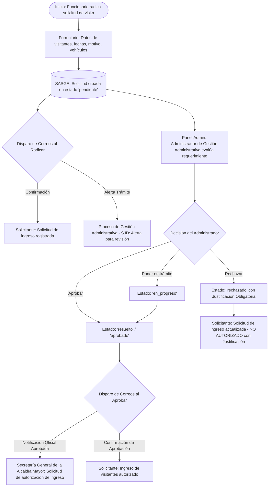
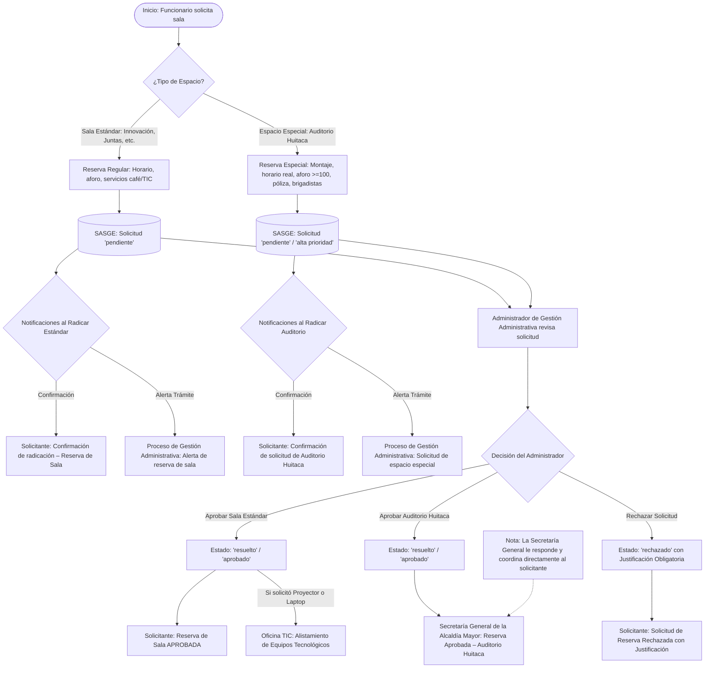
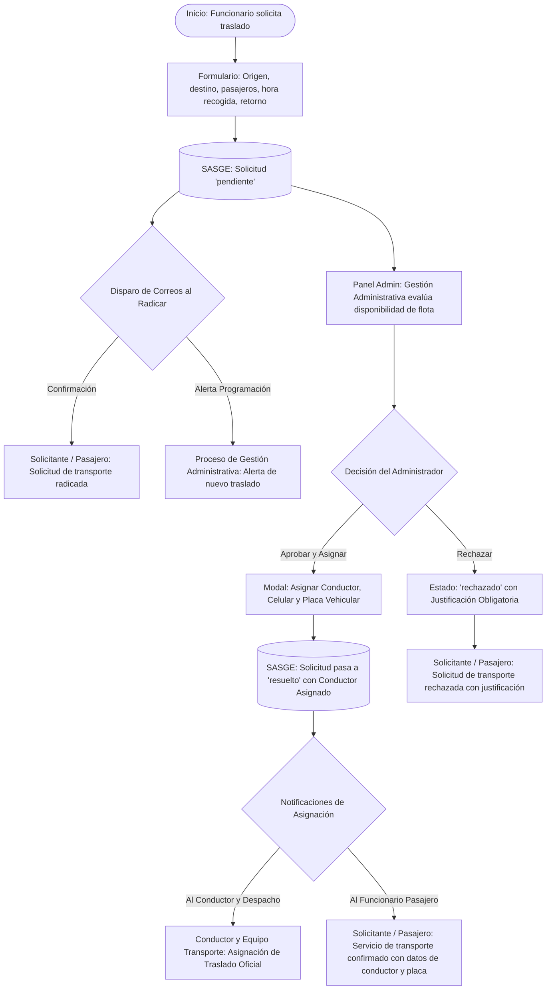
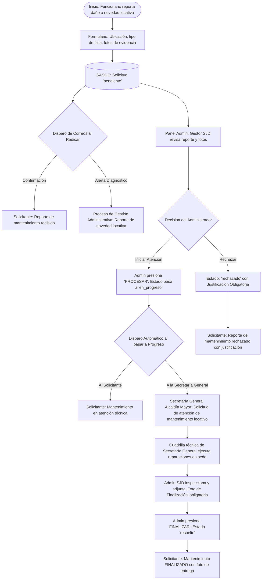
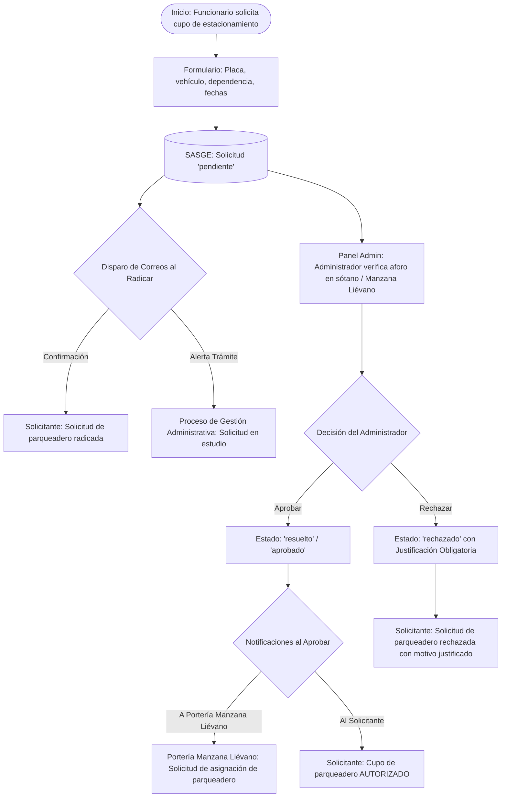

# Flujogramas Operativos y Matriz de Notificaciones por Módulo — SASGE
**Sistema de Administración de Servicios Generales (SASGE)**  
**Secretaría Jurídica Distrital — Proceso de Gestión Administrativa**

---

## 📌 Guía Rápida para Generación de Imágenes
> [!TIP]
> Los diagramas de este documento están redactados en formato **Mermaid**. Puedes copiarlos y pegarlos directamente en herramientas como [Mermaid Live Editor](https://mermaid.live), Draw.io o Notion para exportarlos como imagen (PNG, SVG) o diagramas de alta resolución.

---

## 1. Módulo de Ingreso de Visitantes (`visitors`)

### 1.1. Diagrama de Flujo (Mermaid)



### 1.2. Detalle de Correos Electrónicos del Módulo

| Momento / Evento | ¿Quién lo ejecuta? | Destinatario (`TO`) | Asunto (`SUBJECT`) | Contenido Clave |
| :--- | :--- | :--- | :--- | :--- |
| **Radicación** | Funcionario Solicitante | Funcionario Solicitante | `Solicitud de ingreso registrada – [Nombre(s) Visitante]` | Confirmación de radicación con fechas, dependencia, motivo y nómina de visitantes. |
| **Radicación** | Funcionario Solicitante | **Funcionarios del Proceso de Gestión Administrativa** (`manager`) | `Solicitud de autorización de ingreso – [Nombre(s) Visitante]` | Alerta de radicación para revisión interna, validación y trámite en SASGE. |
| **Aprobación (`resuelto`)** | Proceso de Gestión Administrativa | Funcionario Solicitante | `Ingreso de visitantes autorizado – [Nombre(s) Visitante]` | Notificación formal de que la visita fue **APROBADA**. Recordatorio de presentación de documento original en portería. |
| **Aprobación (`resuelto`)** | Proceso de Gestión Administrativa | **Secretaría General** (`visitors` / `secretaria_general`) | `Solicitud de autorización de ingreso – [Nombre(s) Visitante]` | Ficha oficial de acreditación con nombres, cédulas, vehículos autorizados y fechas. Firma: *Proceso de gestión administrativa*. |
| **Rechazo (`rechazado`)** | Proceso de Gestión Administrativa | Funcionario Solicitante | `Solicitud de ingreso actualizada – Estado: NO AUTORIZADO` | Notificación formal de no autorización con el motivo y justificación institucional obligatoria. |

---

## 2. Módulo de Reserva de Salas y Espacios Especiales (`rooms`)

Distingue entre **Salas Convencionales** (Reuniones internas) y **Salas Especiales / Eventos Magnos** (Auditorio Huitaca / Secretaría General de la Alcaldía Mayor).

### 2.1. Diagrama de Flujo (Mermaid)



### 2.2. Detalle de Correos Electrónicos del Módulo

| Momento / Evento | ¿Quién lo ejecuta? | Destinatario (`TO`) | Asunto (`SUBJECT`) | Contenido Clave |
| :--- | :--- | :--- | :--- | :--- |
| **Radicación (Estándar)** | Funcionario Solicitante | Funcionario Solicitante | `Confirmación de radicación – Reserva de Sala [Sala] ([Fecha])` | Confirmación con datos del espacio, fecha, horario y servicios solicitados. |
| **Radicación (Estándar)** | Funcionario Solicitante | **Funcionarios del Proceso de Gestión Administrativa** (`manager`) | `Alerta de Servicio: Solicitud de Sala [Sala] ([Fecha])` | Notificación para verificación de agenda, disponibilidad y alistamiento logístico. |
| **Radicación (Auditorio Huitaca)** | Funcionario Solicitante | Funcionario Solicitante | `Confirmación de radicación – Solicitud Auditorio Huitaca ([Fecha])` | Confirmación de solicitud especial magno con horarios de montaje y evento. |
| **Radicación (Auditorio Huitaca)** | Funcionario Solicitante | **Funcionarios del Proceso de Gestión Administrativa** (`manager`) | `Alerta de Espacio Especial: Auditorio Huitaca ([Fecha])` | Alerta de alta prioridad para revisión de aforo, póliza extracontractual y brigadistas. |
| **Aprobación Sala Estándar** | Proceso de Gestión Administrativa | Funcionario Solicitante | `Reserva de Sala APROBADA – [Sala] ([Fecha])` | Confirmación oficial de asignación del espacio y recomendaciones de uso. |
| **Soporte Tecnológico (Solo tras aprobar Sala Estándar)** | Proceso de Gestión Administrativa / SASGE | Oficina de TIC (`rooms_tic`) | `SASGE TIC: Alistamiento de Equipos - [Sala] ([Fecha])` | Notificación que **se dispara solo después de aprobada la sala estándar** si requiere proyector, laptop o soporte HDMI. |
| **Aprobación Auditorio Huitaca** | Proceso de Gestión Administrativa | **Secretaría General Alcaldía Mayor** (`rooms_special`) | `Reserva Aprobada – Auditorio Huitaca ([Fecha])` | Ficha técnica completa enviada **exclusivamente a Secretaría General**: Horarios de montaje vs. evento real, aforo, entidad, póliza extracontractual y brigadistas. Firma: *Proceso de gestión administrativa*. *(La Secretaría General responde y confirma directamente al solicitante)*. |
| **Rechazo (`rechazado`)** | Proceso de Gestión Administrativa | Funcionario Solicitante | `Solicitud de reserva de sala rechazada – [Sala]` | Motivo o justificación institucional obligatoria de no disponibilidad de la sala. |

---

## 3. Módulo de Flota de Transporte Oficial (`transport`)

### 3.1. Diagrama de Flujo (Mermaid)



### 3.2. Detalle de Correos Electrónicos del Módulo

| Momento / Evento | ¿Quién lo ejecuta? | Destinatario (`TO`) | Asunto (`SUBJECT`) | Contenido Clave |
| :--- | :--- | :--- | :--- | :--- |
| **Radicación** | Funcionario Solicitante | Funcionario Pasajero / Solicitante | `Solicitud de transporte radicada – [Destino] ([Fecha])` | Itinerario de viaje, hora estimada de recogida, origen, destino y pasajeros. |
| **Radicación** | Funcionario Solicitante | **Funcionarios del Proceso de Gestión Administrativa** (`manager`) | `Alerta de Transporte: Traslado a [Destino] ([Fecha])` | Requerimiento de movilización para programación y asignación de conductor. |
| **Aprobación y Asignación** | Proceso de Gestión Administrativa | Funcionario Pasajero / Solicitante | `Servicio de transporte confirmado – Conductor asignado` | Confirmación con nombre del conductor asignado, teléfono móvil y placa del vehículo institucional. |
| **Aprobación y Asignación** | Proceso de Gestión Administrativa | Conductor Asignado y Despacho (`transport`, `manager`) | `Asignación de Traslado: [Destino] – [Fecha]` | Orden de servicio con ruta, contactos del pasajero, hora de presentación y observaciones. |
| **Rechazo (`rechazado`)** | Proceso de Gestión Administrativa | Funcionario Pasajero / Solicitante | `Solicitud de transporte no disponible / rechazada` | Notificación de no disponibilidad de vehículos o conductores con justificación institucional obligatoria. |

---

## 4. Módulo de Mantenimientos Locativos (`maintenance`)

### 4.1. Diagrama de Flujo (Mermaid)



### 4.2. Detalle de Correos Electrónicos del Módulo

| Momento / Evento | ¿Quién lo ejecuta? | Destinatario (`TO`) | Asunto (`SUBJECT`) | Contenido Clave |
| :--- | :--- | :--- | :--- | :--- |
| **Radicación** | Funcionario Solicitante | Funcionario Solicitante | `Reporte de mantenimiento recibido – [Elemento]` | Confirmación de ticket de mantenimiento con ubicación, prioridad y descripción. |
| **Radicación** | Funcionario Solicitante | **Funcionario del Proceso de Gestión Administrativa** (`manager`) | `Reporte de mantenimiento locativo – [Elemento] – [Ubicación]` | Diagnóstico preliminar, nivel de urgencia y fotos del daño para revisión interna en SASGE. |
| **En Progreso (`en_progreso`)** | Proceso de Gestión Administrativa | Funcionario Solicitante | `Actualización de mantenimiento – [Elemento] (EN ATENCIÓN TÉCNICA)` | Aviso de inicio de labores o gestión técnica en curso. |
| **En Progreso (`en_progreso`)** | Proceso de Gestión Administrativa | **Secretaría General** (`maintenance`) | `Solicitud de atención de mantenimiento locativo – [Elemento] – [Ubicación]` | **Envío automático a la Secretaría General** de la Alcaldía Mayor con la novedad locativa, fotos y ubicación para programar cuadrilla técnica. Firma: *Proceso de gestión administrativa*. |
| **Cierre / Resuelto (`resuelto`)** | Proceso de Gestión Administrativa | Funcionario Solicitante | `Mantenimiento locativo finalizado – [Elemento]` | Notificación formal de entrega con evidencia fotográfica del trabajo finalizado. |
| **Rechazo (`rechazado`)** | Proceso de Gestión Administrativa | Funcionario Solicitante | `Reporte de mantenimiento locativo no procedente / rechazado` | Notificación formal con justificación institucional obligatoria de improcedencia del reporte. |

---

## 5. Módulo de Parqueaderos (`parking`)

### 5.1. Diagrama de Flujo (Mermaid)



### 5.2. Detalle de Correos Electrónicos del Módulo

| Momento / Evento | ¿Quién lo ejecuta? | Destinatario (`TO`) | Asunto (`SUBJECT`) | Contenido Clave |
| :--- | :--- | :--- | :--- | :--- |
| **Radicación** | Funcionario Solicitante | Funcionario Solicitante | `Solicitud de parqueadero radicada – Placa [Placa]` | Datos del vehículo, placa, fecha y trámite de ingreso en estudio. |
| **Radicación** | Funcionario Solicitante | **Funcionarios del Proceso de Gestión Administrativa** (`manager`) | `Alerta de Asignación: Cupo de Parqueadero – Placa [Placa]` | Notificación para control de disponibilidad de cupos en sótano / Manzana Liévano. |
| **Aprobación (`resuelto`)** | Proceso de Gestión Administrativa | **Portería Manzana Liévano / Parqueaderos** (`parking`) | `Solicitud de asignación de parqueadero – [Nombre] – Placa [Placa]` | Autorización de acceso vehicular, placa, marca/color y dependencia. Firma: *Proceso de gestión administrativa*. |
| **Aprobación (`resuelto`)** | Proceso de Gestión Administrativa | Funcionario Solicitante | `Asignación de parqueadero AUTORIZADA – Placa [Placa]` | Confirmación de cupo autorizado y protocolo de uso de los estacionamientos. |
| **Rechazo (`rechazado`)** | Proceso de Gestión Administrativa | Funcionario Solicitante | `Solicitud de parqueadero rechazada` | Notificación de no disponibilidad de cupos vehiculares con justificación institucional obligatoria. |

---

## 6. Resumen de Reglas Globales de Correo en SASGE

1. **Remitente Unificado:**
   * Todos los correos institucionales salen desde: `SASGE@secretariajuridica.gov.co` (o variable `FROM_EMAIL`).
2. **Firma Oficial:**
   * Todos los correos del sistema finalizan con:
     ```text
     Cordialmente,
     Secretaría Jurídica Distrital
     Proceso de gestión administrativa
     ```
3. **Exclusión de Enlaces Externos:**
   * Los correos dirigidos a personal externo o sin cuenta en SASGE (**Secretaría General de la Alcaldía Mayor, Portería de Visitantes y Portería de Parqueaderos de la Manzana Liévano**) **NUNCA** llevan botones de *"Ver Solicitud en SASGE"* ni enlaces que exijan autenticación en la plataforma.
4. **Respaldo Dinámico:**
   * La lista de destinatarios se obtiene en tiempo real desde la configuración (`service_emails`) y se envía directamente desde la interfaz web activa para garantizar que nunca se pierda un correo aunque la base de datos se esté sincronizando.
